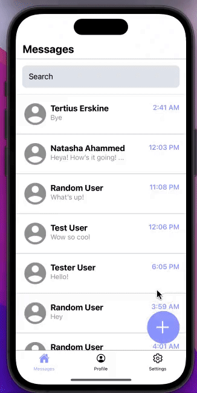

# MyMessages - React Native Messaging App 
A chat messaging app built with React Native and Firebase.

## Overview 

MyMessages is a chat messaging app providing user authentication, real-time communication, and support for iOS and Android. The app provides a custom messaging experience with different options to select from, including dark/light mode, changing fonts, and different colour themes. Users can also change their profile settings, such as adding a profile photo or updating their personal information. 

## Screens

### Login/Register Screen
* User Authetication using Firebase 
* Email, full name, birth date and password associated with each user
* Form validation and password strength indicator
* System preferences for light/dark mode applied

### Home Screen 
* Loads conversations into list, which is stored in the database as conversation history 
* Search menu modal to view and search contacts by keywords

### Profile Screen 
* Change and update user profile settings 
* Update photo, firstname, last name, birth date

### Chat Screen 
* Allows users to commuicate in real time
* Scrollable view to view past messages
* Updates message history with datestamps and timestamps 

### Settings 
* Allows for users to choose color theme which changes the accent colour of components throughout the app
* Change the system font for titles and messages 
* Toggle between dark mode and light mode manually 
* When saved, settings are stored to their account and loaded when the app is reopened 

## Concepts Applied 
* Dynamic interface building with React Native Components 
* Firebase Database for user creation and authentication, conversations, and message storage 
* React Redux for global data accessiblity and updates for state management 
* Redux stores for users, messages, fonts, dark/light mode, and colour themes
* State management using React Hooks 
* React Navigation and Tab Bar Navigation 
* Login and Registration validation 
* Vector animations using Animated API components 
* Flatlists and Scrollable Views to view messages and conversations 
* Modals for search menu and alerts for user notifications

## Sample Views 

